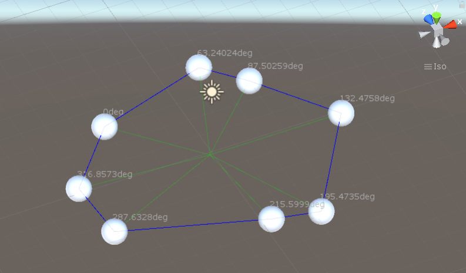

# dots-to-circles
A set of components in Unity to create a path that resembles a circle passing through n dots.
Unity version: Unity 2019.4.19f1 (64-bit) (recommended)

## Target Functionality
I was asked to provide a system for the player to place different objects in the scene, then connect them to create a cicular(ish) mesh to use as an emitter for a generic particle system.

## Implementation
Each point is a GameObject with a DotComponent attached, the shape is an empty GameObject with a CircleComponent attached, parent to all the dots. Both rely on a vector helper tool.

- Project all points on the ground
- Define a centroid (average)
- Rotate around the centroid clockwise and draw the shape passing once through each point
- When n points share the same radius, start and end the connection from the closest/farthest from the centroid (to avoid "spikes" in the shape)

Relevant scripts: https://github.com/impproductions/2POC/tree/master/unity/dots-to-circles/Assets/Scripts

## Implementation
To test it: download, open in Unity, press play, open the scene view and drag any of the spheres around.
